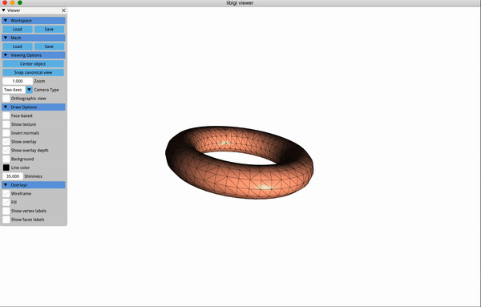

## Introduction

This is my implementation of rigid body simulation assignment in [CSC417/CSC2549-Physics-based Animation](https://github.com/dilevin/CSC417-physics-based-animation).


## Build & Execution
```
git submodule update --init --recursive
mkdir build
cd build
cmake .. -DCMAKE_BUILD_TYPE=Release
make 
./a5-cloth-simulation
```